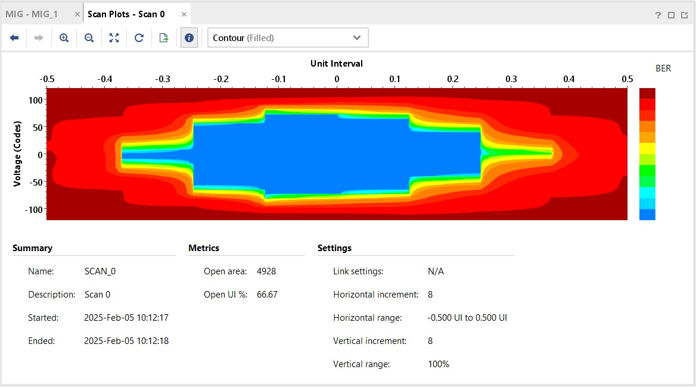

# goals for this repository

Retarget Analog Devices's DAQ3 and AD9081 projects to work with the zcu106,
or perhaps also the zcu102 if we use that instead.
Also for general expermentation.

It implements parts of the block diagram that I uploaded to Basecamp
called "dans_transitional_HDL_block_diagram.jpg".


# DAQ3 status

The DAQ3 bitfile for the zcu106 can fully access the DAQ3 ADCs and DACs.  The device tree is OK, and linux boots.

When storing I&Q samples, the DAQ3 HDL uses the 2GByte ddr4 ram as a fifo.  It uses a total of four bytes to store one 12-bit I sample and one 12-bit Q sample.  However, this does not limit the capture to just 2G/4 = 512k samples, because the PS simultaneously drains the fifo.  In practice, I have been able to capture 100ms = 117M samples of consecutive samples to a file on the board, with no loss.


# AD9081/AD9988 status

Supposedly the ad9081 HDL works with both the ad9081evb and the 9988evb.
AD's overview of their HDL is described:

https://analogdevicesinc.github.io/hdl/2023_R2/projects/ad9081_fmca_ebz

The site shows different ways to configure the link, which can be done by modifying system_project.tcl.  We can get up to 975Msps if we use only 4 lanes, but we can easily get 1Gsps if we use 8 lanes.  So I parameterized it for L=8 lanes, M=4 converters, S=4 ???.  The lanes use 8B10B at a rate of 10GHz, so the bit rate is 8GHz, so two lanes yield 16Gbps, which is one sample from one converter.  timining_constr.xdc is modified accordingly. 

Analog's scripts create the 9081's ADC and DAC fifos differently from the DAQ3 design.  It uses lots of BRAM, which isn't as good as using URAM or the DDR4RAM, so I suspect the DAQ3 sources are newer.  See quanet_hdl/projects/ad9081_fmca_ebz/zcu106/system_project.tcl for detailed resource utilization, but at a high level it uses 19.5% of CLBs, 50% of the BRAMS, 0% URAM, 0% PL DDR4.

The clkin10 is not connected to the zcu106.  But I'm pretty sure we can use the same clock for tx and rx, and one way is by using the parameter SHARED_DEVCLK = 1.

To build, go to
'quanet_hdl/projects/ad9081_fmca_ebz/zcu106'
and run make.

I plugged a 9988 board into a zcu106 with my bitfile and device tree.
The device tree allows linux to boot.

The driver for the ad7175 power measurement chip runs so it appears in
iio_info.  This chip is muxed onto the same SPI bus (spi0) as the 9988
chip, which maybe means spi0 is working.  But the driver for the 9988
tries to write and read back a byte from a register, and this fails,
so it errors out.  That is all I've had time to figure out.


# objects

Copy this to /boot/BOOT.BIN on your SD card:

`quanet_hdl/nucrypt_boot_objs/zcu106_BOOT.BIN`

Copy this to the /boot/system.dtb on your SD card: (dont name it devicetree.dtb)

`quanet_hdl/nucrypt_boot_objs/zynqmp-zcu106-fmcdaq3.dtb`


# 10G Classical Link

We added a Xilinx iBERT core to drive the zcu106's SFP at 10Gbaud.  At the
HappyCamper event, we had compatibility troubles between our SFPs and the
classical NICs.  By adding an SFP driver to the zcu106 design, we can bypass
that sort of trouble, to allow system testing even if we don't have a classical
NIC.  It's a very "dumb" interface, so it ought to always work.
The iBERT core also allows Xilinx software to construct an eye diagram:



# summary of changes made to HDL

This HDL was copied from Analog Device's repository, and then modified
to suit our needs.  To implement our lidar-like CDM function, we need
the ADC to start capturing at time deterministically related to when
the DAC outputs a "probe".  To implement rapid two-level noise
measurements, our hardware features an optical switch that operates at
~100kHz to alternately block or pass light to the detectors, and this
control signal must also be driven deterministically to when the ADC
begins capturing samples.  So I changes `library/util_dacfifo`
and `library/xilinx/axi_adcfifo`.

These IPs have now been replaced by new IPs called `library/quanet_dac'
and `library/xilinx/quanet_adc'.

We wanted to keep the HDL compatible with AD's libiio C API:
`https://analogdevicesinc.github.io/libiio/v0.25/libiio/index.html`
First, C code writes to quanet registers to set the select lines
to the demux to the recieve DMA, and the mux to the transmit DMA.
Then C code uses the normal IIO calls such as `iio_channel_write()`,
`iio_buffer_push(dac_buf)`, and or `iio_buffer_refill(adc_buf)`.
Generating CDM probes does not require any DMA at all, because
they're generated from an LFSR.


# porting Kuiper Linux to the ZCU106

I got my 2022_r2 linux image from  
https://wiki.analog.com/resources/tools-software/linux-software/adi-kuiper_images/release_notes  
This is about building Kuiper linux:  
https://wiki.analog.com/resources/tools-software/linux-drivers-all  
https://wiki.analog.com/resources/tools-software/linux-build/generic/zynqmp  

On my VM I installed lex, bison, U-boot-tools, and  libssl-dev.
I also installed Vitis 2023.2
Then I cloned the AD Linux sources:
```
git clone -b 2022_r2  https://github.com/analogdevicesinc/linux.git
```
Then I created the file:
linux/arch/arm64/boot/dts/xilinx/zynqmp-zcu106-fmcdaq3.dts
Which is based on a copy of the zcu102 dts.  I copied this to:  
quanet_hdl/nucrypt_boot_objs/zynqmp-zcu106-fmcdaq3.dts  
Note: I did not make a full copy of the kuiper linux source tree on this repository.  

Here are the instructions specific to zynqmp:  
https://wiki.analog.com/resources/tools-software/linux-build/generic/zynqmp  
The AD instructions say to copy a build script, which I did and I called `bldu.sh`.  Note that this is different from the zynq build script, I then modified `bldu.sh` so that you just run it and you cant specify any command line arguments, and it will build xilinx\zynqmp-zcu106-fmcdaq3.dtb. (a copy of `bldu.sh` is in my github in nucrypt_build_objs)

Since Vitis has the cross compiler, the next thing to do is to put that on the path:
```
source /tools/Xilinx/Vitis/2023.2/settings64.sh
```
And if you don't do that, the bdlu.sh script will download a different cross compiler (Linaro) and try to use it.  I have not explored that method.  Then I ran the script:
```
./bldu.sh
```
It produced `Image` and `xilinx\zynqmp-zcu106-fmcdaq3.dtb`, both of which I copied to github in `nucrypt_build_objs`.

I built my bitfile inside cygwin.  You can also do this in linux, but I have not tried.
```
cd quanet_hdl/projects/daq3/zcu106
make
```

This produces:

hdl-main/projects/daq3/zcu106/daq3_zcu106.runs/impl/system_top.bit
hdl-main/projects/daq3/zcu106/daq3_zcu106.sdk/system_top.xsa

The bitfile gets put into BOOT.BIN.

There are probably better ways to make the BOOT.BIN, but for now I'm
using a method similar to AD's document on building BOOT.BIN:
https://analogdevicesinc.github.io/hdl/user_guide/build_boot_bin.html
Which says to copy a script and run it.  I did that, modified it, and
named it (on github) as: `projects/daq3/zcu106/build_boot.bat` This
script builds the fsbl.elf and the pmufw.elf file.  Since the PS
configuration seldom changes, these probably don't have to be
recompiled every time the HDL is built, but they are.  I did not build
u-boot.elf.  Both u-boot.elf and bl31.elf can be extracted from the
project folder on the AD Kuiper linux SD Card image.  After you put
the image on an SD card, you can navigate (I used microsoft "File
Explorer") to the boot partition and get the stuff in
`/boot/zynqmp-zcu102-rev10-fmcdaq3` and unpack it.  I put a copy of
that directory on github under nucrypt_boot_objs and unpacked
bootgen_sysfiles.tgz there.  Note that this contains a BOOT.BIN for
the zcu106, but I didn't use that or even try that.  I only wanted the
elf files.  I made my build_boot.bat pull those elf files into the
BOOT.BIN that it builds.  AD's script auto-generates the zynq.bif
file, but I just hand-wrote mine for ease of tweaking.


# Register Spaces

Initially I had made a new IP called quanet_regs, that had a slave axi
interface.  It implemented registers that controlled three other IPs:
the util_dacfifo, the axi_adcfifo, and also the quanet_sfp.  I had to
make connections between them in daq_bd.tcl.

Then I changed it so that each IP has its own slave axi interface, and
its own set of registers.  While this might make the AXI buses consume
more resources, this makes the IPs less interdependent.  It also means
less connections have to be made in daq_bd.tcl, which becomes simpler.
It also allows each IP to have its own CDC constraints right there in
the source code, as opposed to putting those constraints in yet
another separate build file (system_constr.xdc).

Register fields are automatically syntactically extracted from the
HDL source code to produce a .h include file for C.


# notes on AD's HDL

I found this web page useful:

https://analogdevicesinc.github.io/hdl/library/jesd204/axi_jesd204_rx/index.html#axi-jesd204-rx

Interestingly, AD also offers a Corundum core IP.

https://analogdevicesinc.github.io/hdl/library/corundum/index.html


# qnicll, the low level library

Now in

https://github.com/danreilly/qnicll


