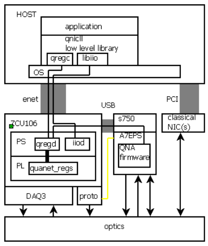

# goals for this repository

Retarget Analog Devices's libiio and HDL to make the DAQ3 board work with the zcu106.

Develop low level library for qnic  


# status
The DAC on the DAC3 works!  ADC does not yet work.


# objects

Copy this to the  /boot partition of your SD card:

`quanet_hdl/nucrypt_boot_objs/BOOT.BIN`

Copy this to the /boot partition of your SD card and name it system.dtb (not devicetree.dtb)

`quanet_hdl/nucrypt_boot_objs/zynqmp-zcu106-fmcdaq3.dtb`


# Porting Kuiper Linux to the ZCU106

I got my 2022_r2 linux image from  
https://wiki.analog.com/resources/tools-software/linux-software/adi-kuiper_images/release_notes  
This is about building Kuiper linux:  
https://wiki.analog.com/resources/tools-software/linux-drivers-all  
https://wiki.analog.com/resources/tools-software/linux-build/generic/zynqmp  

On my VM I installed lex, bison, U-boot-tools, and  libssl-dev.
I also installed Vitis 2023.2
Then I cloned the AD Linux sources:
```
git clone -b 2022_r2  https://github.com/analogdevicesinc/linux.git
```
Then I created the file:
linux/arch/arm64/boot/dts/xilinx/zynqmp-zcu106-fmcdaq3.dts
Which is based on a copy of the zcu102 dts.  I copied this to:  
quanet_hdl/nucrypt_boot_objs/zynqmp-zcu106-fmcdaq3.dts  
Note: I did not make a full copy of the kuiper linux source tree on this repository.  

Here are the instructions specific to zynqmp:  
https://wiki.analog.com/resources/tools-software/linux-build/generic/zynqmp  
The AD instructions say to copy a build script, which I did and I called `bldu.sh`.  Note that this is different from the zynq build script, I then modified `bldu.sh` so that you just run it and you cant specify any command line arguments, and it will build xilinx\zynqmp-zcu106-fmcdaq3.dtb. (a copy of `bldu.sh` is in my github in nucrypt_build_objs)

Since Vitis has the cross compiler, the next thing to do is to put that on the path:
```
source /tools/Xilinx/Vitis/2023.2/settings64.sh
```
And if you don't do that, the bdlu.sh script will download a different cross compiler (Linaro) and try to use it.  I have not explored that method.  Then I ran the script:
```
./bldu.sh
```
It produced `Image` and `xilinx\zynqmp-zcu106-fmcdaq3.dtb`, both of which I copied to github in `nucrypt_build_objs`.

I built my bitfile inside cygwin.  You can also do this in linux, but I have not tried.
```
cd quanet_hdl/projects/daq3/zcu106
make
```

This produces:

hdl-main/projects/daq3/zcu106/daq3_zcu106.runs/impl/system_top.bit
hdl-main/projects/daq3/zcu106/daq3_zcu106.sdk/system_top.xsa

There are probably better ways to make the BOOT.BIN, but for now I'm using a method similar to AD's document on building BOOT.BIN:  
https://analogdevicesinc.github.io/hdl/user_guide/build_boot_bin.html  
Which says to copy a script and run it.  I did that, modified it, and named it (in my github) as:  
projects/daq3/zcu106/build_boot.bat  
This script builds the fsbl.elf and the pmufw.elf file.  
I did not build u-boot.elf.  Both u-boot.elf and bl31.elf can be extracted from the project folder on the AD Kuiper linux SD Card image.  After you put the image on an SD card, you can navigate (I used microsoft "File Explorer") to the boot partition and get the stuff in /boot/zynqmp-zcu102-rev10-fmcdaq3 and unpack it.  I put a copy of that directory on github under nucrypt_boot_objs and unpacked bootgen_sysfiles.tgz there.  Note that this contains a BOOT.BIN for the zcu106, but I didn't use that or even try that.  I only wanted the elf files.  
I made my build_boot.bat pull those elf files into the BOOT.BIN that it builds.  


# Notes on AD's HDL

I found this web page useful:

https://analogdevicesinc.github.io/hdl/library/jesd204/axi_jesd204_rx/index.html#axi-jesd204-rx

Interestingly, AD also offers a Corundum core IP.

https://analogdevicesinc.github.io/hdl/library/corundum/index.html


# qnicll, the low level library

This fits into the qnic as shown.  It's not ideal, but it's a first step.




